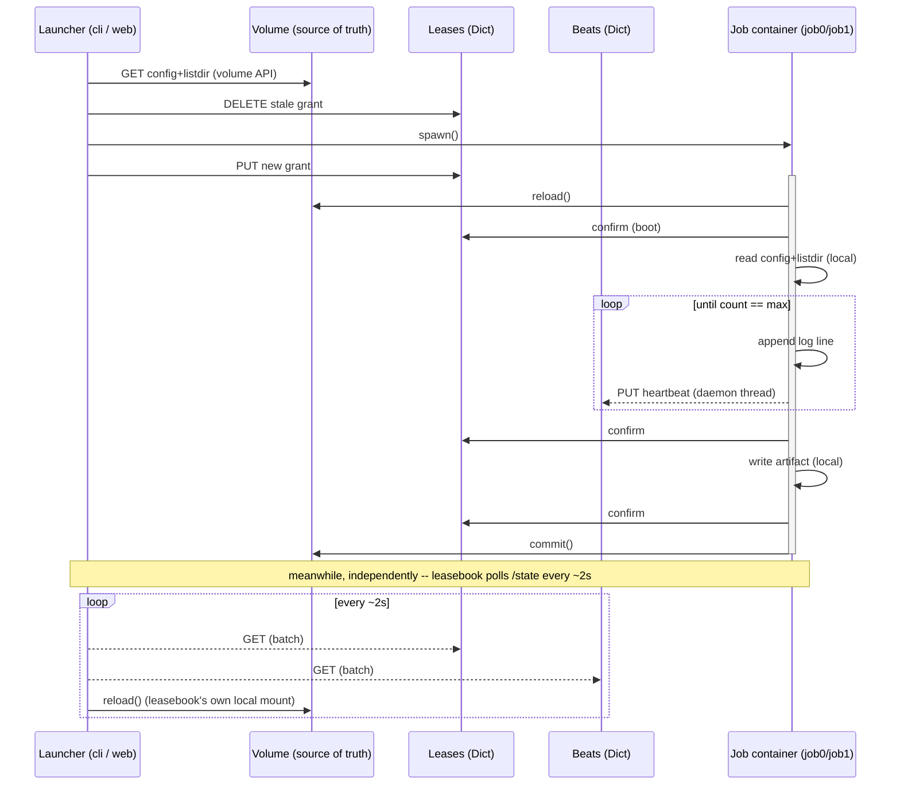

# launchpad

Runs are folders on a Modal Volume; state and orchestration are two Modal
Dicts and one web container.

## Where things live

- **Volume (`trainvols`)**: one folder per run, `runs/{run_id}/`. Holds
  `config.json` (which job_uids this run declares, their parameters and
  dependencies), each job's `{job_uid}_artifact.txt` (its completion
  marker), and `logs/{call_id}/{job_type}.log`.
- **Dict `launchpad-leases`**: one entry per run_id, naming the call_id
  currently holding that run (there can be only one at a time -- a run's
  lease).
- **Dict `launchpad-beats`**: one entry per call_id, the timestamp of its
  last heartbeat -- how a reader tells a live call from a dead one.

## Read/write traffic

- **`leasebook`** (the web app) is pinned to a single container
  (`max_containers=1`) -- it's both the dashboard and the launcher, so
  there's one copy of the traffic pattern below, not several racing each
  other.
  - `/state`: reads the Dicts directly (cheap either way, no mount needed)
    and reads each run's `config.json`/artifacts off `leasebook`'s own
    **local mount** of the volume -- fast, but only as fresh as that
    container's last `volume.reload()` (called once per request).
  - `/launch/{run_id}/{job}`: pops the stale lease key, spawns the job's
    Modal function, writes the new grant -- then returns immediately, it
    doesn't wait for the job to finish.
- **Job containers** (`etl`, `job0`, `job1`) mount the volume too, write
  locally, and only publish those writes with an explicit `volume.commit()`
  right before exiting -- nothing is visible to any reader, mounted or not,
  until that commit lands.
- **The local CLI** (`launch`, `launch_job`, `push_config`) has no mount at
  all -- it reads/writes the volume over its API (`read_file` / `listdir` /
  `batch_upload`), a network round trip per call, and reads/writes the
  Dicts directly the same way containers do.

So the volume is always the actual source of truth; every reader --
mounted or not -- is working from some snapshot of it: a local mount
refreshed on `reload()`, or a live-but-slower API call.

## One job, traced

`job0` spawned, run to completion, and exited -- against the two Dicts and
the volume it reads and writes along the way. Running the whole time
alongside it, on its own clock: `leasebook`, polling `/state` for a picture
of the very same run through its own separate local mount.

A job's writes are private until `commit()` publishes them to the volume --
its log, its artifact, its dependency check all live only on that one
container's own disk until then. `leasebook` keeps a separate copy of its
own, refreshed by its own `reload()` whenever something polls `/state` --
so the dashboard's view of a run is never more than one poll behind
whatever's been committed, and never less than one commit behind whatever
the job is actually doing. Neither container's disk is the other's cache;
the volume is the only thing both of them agree on.
