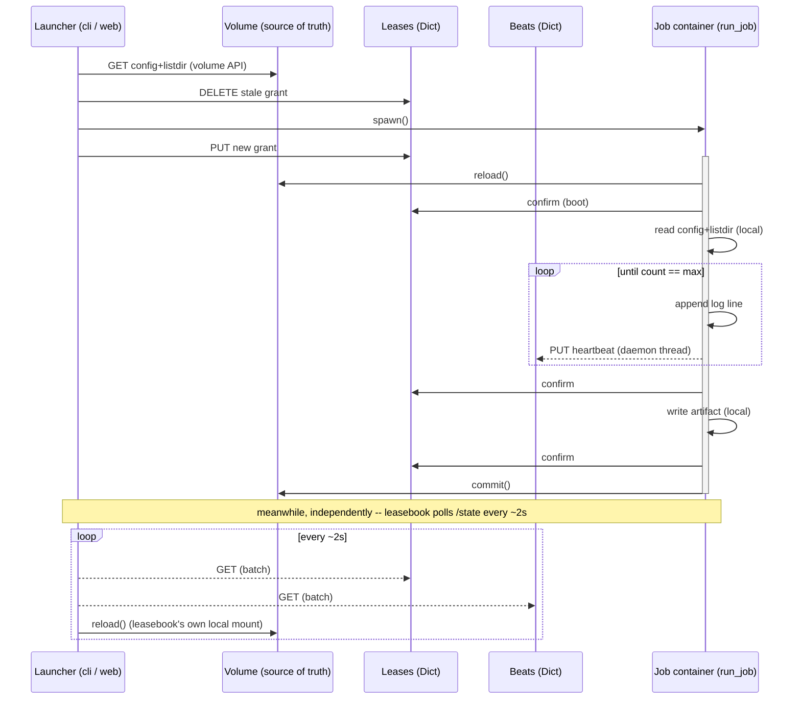

# launchpad

Runs are folders on a Modal Volume; state and orchestration are two Modal
Dicts and one web container.

## Where things live

- **Volume (`trainvols`)**: one folder per run, `runs/{run_id}/`. Holds
  `config.json` (which job_uids this run declares, their parameters,
  dependencies, and resources), each job's `{job_uid}_artifact.txt` (its
  completion marker), and each artifact's own `logs/{call_id}/job.log` --
  nested under that artifact's own folder rather than the run's, since a
  lease (and so a log) is granted per artifact, not per run (see
  `runtime.initialize_worker`). Level and category conventions for what
  goes in these files are in [LOGGING.md](LOGGING.md).
- **Dict `launchpad-leases`**: one entry per run_id, naming the call_id
  currently holding that run (there can be only one at a time -- a run's
  lease).
- **Dict `launchpad-beats`**: one entry per call_id, the timestamp of its
  last heartbeat -- how a reader tells a live call from a dead one.

## The lab (removed for now)

There was a `jupyter` function serving JupyterLab with the volume mounted,
linked from the dashboard's header. It is gone: no `lab_image`, no `/lab`
route, no `launchpad-lab` secret, and nothing seeds or commits
`/storage/notebooks` any more. Notebooks already saved there are untouched.

What survives is [lab.py](lab.py), the API those notebooks import -- a thin
wrapper over `dag.resolve` that works anywhere `lab.ROOT` is a real mount:

```python
import lab
lab.ls("tokenizers")                              # what's declared
lab.load("tokenizers/bpe-3.0k-e4649eb4ff")        # by path, bound if built
Tokenizer(vocab_size=3000, ...).bind(lab.ROOT)    # by parameters, equal artifact
lab.check(pretraining); lab.declare(pretraining)  # local, not a round trip
```

Bringing the lab back means re-adding the image and the `web_server`
function, plus the secret; nothing in `lab.py` has to change.

## Read/write traffic

- **`leasebook`** (the web app) is pinned to a single container
  (`max_containers=1`) -- it's both the dashboard and the launcher, so
  there's one copy of the traffic pattern below, not several racing each
  other.
  - `/state`: reads the Dicts directly (cheap either way, no mount needed)
    and reads each run's `config.json`/artifacts off `leasebook`'s own
    **local mount** of the volume -- fast, but only as fresh as that
    container's last `volume.reload()` (called once per request).
  - `/launch/{run_id}/{job}`: pops the stale lease key, spawns the job's
    Modal function, writes the new grant -- then returns immediately, it
    doesn't wait for the job to finish.
- **Job containers** (`etl`, `run_job`) mount the volume too, write
  locally, and only publish those writes with an explicit `volume.commit()`
  right before exiting -- nothing is visible to any reader, mounted or not,
  until that commit lands.
- **The local CLI** (`launch`, `launch_job`, `push_config`) has no mount at
  all -- it reads/writes the volume over its API (`read_file` / `listdir` /
  `batch_upload`), a network round trip per call, and reads/writes the
  Dicts directly the same way containers do.

So the volume is always the actual source of truth; every reader --
mounted or not -- is working from some snapshot of it: a local mount
refreshed on `reload()`, or a live-but-slower API call.

## Jobs

**Organized** as plain classes in `jobs.py`, one per job_uid, no base class
-- two classes implementing the same three members don't need a third to
agree on it:

- `job_uid: str`, a class attribute -- names both the class and its
  config.json entry (below), and is what the artifact filename, the log
  file's name, and every log line's own labels are built from.
- `__init__(self, run_id, logger, confirm_lease)` -- reads this job_uid's
  own entry out of the run's `config.json`, and raises `JobError` if the
  run isn't one it can run (no config.json, or the entry's missing).
- `.run() -> None` -- does the work, checking its own dependencies first,
  and calls `self.confirm(label)` (which can raise `LeaseLost`) before
  anything it wouldn't want a superseded container to have done.

`main.py`'s `JOBS` dict is built from each class's own `job_uid`
(`{cls.job_uid: cls for cls in (...)}`, never a hand-typed string), and
its `run_job(run_id, job_uid)` Modal function is the only thing that ever
constructs or calls one -- looked up by `job_uid`, one function for every
job rather than one per class. Adding a job is one class here plus one
entry in some run's config; nothing else to wire up.

**Specified** per run, in that run's `config.json`, under `"jobs"`:

```json
{"jobs": {"<job_uid>": {
    "parameters": {...},
    "dependencies": ["<job_uid>", ...],
    "resources": {"cpu": 1, "gpu_type": "A100", "gpu_count": 1}
}}}
```

- `parameters` -- read by the job class itself, inside its own
  `__init__` (e.g. job0's `max`). Nothing outside the class touches these.
- `dependencies` -- other job_uids that must have already left their
  artifact behind. Checked twice, deliberately: once by `attempt_launch`
  before spawning at all (so a blocked job never burns a container), and
  again by the job itself inside `.run()` (so a dependency that goes
  missing between that check and the container actually booting still
  gets caught).
- `resources` -- optional, and read only by `attempt_launch`, never by the
  job -- turned into `Function.with_options(cpu=..., gpu=...)` kwargs
  before spawning. A job_uid that declares none runs on `run_job`'s own
  default pool, the same one every job runs on today.

A job_uid with no entry in a run's `config.json` can't be launched at all
-- `attempt_launch` refuses before ever touching a lease.

## One job, traced

`job0` spawned, run to completion, and exited -- against the two Dicts and
the volume it reads and writes along the way. Running the whole time
alongside it, on its own clock: `leasebook`, polling `/state` for a picture
of the very same run through its own separate local mount.



A job's writes are private until `commit()` publishes them to the volume --
its log, its artifact, its dependency check all live only on that one
container's own disk until then. `leasebook` keeps a separate copy of its
own, refreshed by its own `reload()` whenever something polls `/state` --
so the dashboard's view of a run is never more than one poll behind
whatever's been committed, and never less than one commit behind whatever
the job is actually doing. Neither container's disk is the other's cache;
the volume is the only thing both of them agree on.
